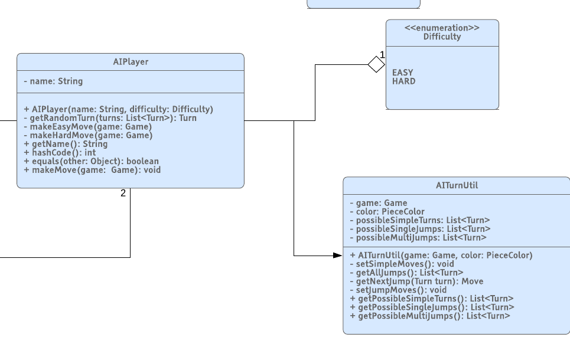
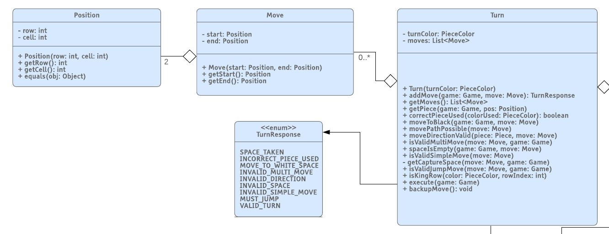

# PROJECT Design Documentation

## Team Information
* Team name: Avoiding Zugzwang
* Team members
  * Andrew Bado
  * Collin Bolles
  * Jacob Jirinec
  * Tristan Knox
  * Evan Nolan

## Executive Summary

How does one recreate a game that is as old and as simple as Checkers in a way that is both exciting and desirable to play? 
The answer is: **WebCheckers**! 
This new rendition of Checkers will leave players wanting more. 
By connecting players worldwide, WebCheckers brings endless opportunity to test your checkers prowess against any number of opponents. 
With the ability to practice against AI players and watch replays, anyone will be able to take their game to the next level. 
So what are you waiting for? Grab your mouse, your keyboard, and your fanciest checkers hat, and **lets play WebCheckers!**

### Purpose
WebCheckers aims to provide users a means to play games of checkers online with players from around the globe.
Additionally, it will allow players to prectice and improve their checkers skills by giving users the option to play
against AI, or to watch previously played games. 

### Glossary and Acronyms

| Term | Definition |
|------|------------|
| MVP  | Minimum Viable Product    |
| OOP  | Object Oriented Programming|
| POJOS| Plain Old Java Objects|
| UI   | User Interface|
| HTML | Hyper Text Markup Language|
| CSS  | Cascading Style Sheets|
| HTTP | Hyper Text Transfer Protocol|
| AI   | Artificial Intelligence|

## Requirements

This section describes the features of the application.

### Definition of MVP
The minimum viable product allows user to log into the web app and play games of checkers with other users. 
This web app enforces standard checkers rules. Users are able to resign from games if they do not wish to finish a game. 

### MVP Features
SignIn  
SignOut  
Start Game  
Resign Game  
Make Moves  
Make Jump Moves  
Make Multi-Jump Moves  
Capture Pieces  
King Pieces  

### Roadmap of Enhancements
Watch Replay  
AI Player  

## Application Domain

This section describes the application domain.

The main entity in the Domain Model is the ‘Checkers Game’ entity. This entity, at a high level, 
handles the interactions that occur with the other domain entities. The ‘Checkers Game’ is played
on a ‘Board’ which is made up of ‘Tiles’ which are the individual spaces on the board. The
relation between the ‘Board’ and ‘Tiles’ are important since the ‘Tiles’ represent different
functionality on the ‘Board’. For example, whether a tile is light or dark impacts whether a ‘Piece’ can be
placed on the given ‘Tile’. Another important entity is the ‘Player’ entity. The ‘Player’
represents the two opposing sides in checkers. ‘Player’ interacts with the ‘Pieces’ and the
color of each ‘Piece’ represents each of the ‘Players’. ‘Turns’ is another important domain
entity as it handles interactions between the ‘Players’ and the ‘Tiles’ through the ‘Move Rules’. 

## Architecture and Design

This section describes the application architecture.

### Summary

The following Tiers/Layers model shows a high-level view of the webapp's architecture.

As a web application, the user interacts with the system using a
browser.  The client-side of the UI is composed of HTML pages with
some minimal CSS for styling the page.  There is also some JavaScript
that has been provided to the team by the architect.

The server-side tiers include the UI Tier that is composed of UI Controllers and Views.
Controllers are built using the Spark framework and View are built using the FreeMarker framework.  The Application and Model tiers are built using plain-old Java objects (POJOs).

Details of the components within these tiers are supplied below.

### Overview of User Interface

This section describes the web interface flow; this is how the user views and interacts
with the WebCheckers application.

As soon as the user enters the Home page they will be greeted by a message that displays how many people
 are currently in the player lobby waiting for a game. If they are not signed in, they will see the option to 
 navigate to a sign in page. There they can put in a name, which is checked to be a valid username. That username 
 is checked for clearance and if it is a good one they move on, otherwise they will be asked to choose a 
 different username and given the rules for which to do so. Once they have successfully signed in, they will be brought to the 
 player lobby. Here, the user can navigate to the replay page to watch replays, or click on one of
 the other available players' names to challenge them to a game. If such a challenge of clicking on the opponent is issued via a click
  on their name, they will be brought to a new page that displays their board positions 
  and be brought to the “In game” state. From here, the user has several options. One such 
  option is to resign, and be taken back to the home page. Another is to play the game 
  by making a move which is validated and then brought to the opponents turn once the turn is submitted.
  If such a move resulted in the ending of a game, they are then brought to the “endgame” 
  where each player will be informed why the game has ended, and wil have the option to exit to the home page. And lastly, each player has the option to sign out at any time.
  If they are in a game, signing out will automatically resign them. When a player signs out, they are taken back to the original home page,
  where they can sign in again, or leave.

### UI Tier

The UI tier is responsible for all of the communications between the user and the server. 
Any time the user is submitting information a post route is used to send data to the server. 
Any time the user’s view needs to be updated a get route is used to render the new view. 
The classes in the UI tier are responsible for user stories such as signing in, starting a game, 
resigning a game, watching replays, and much more.

#### Starting a Game
Once a user has signed in, the GetHomeRoute is responsible for providing a list of all players that are available for a game. 
The user then has the ability to select another player from that list. 
When an opponent is selected, the PostRequestGameRoute is activated and the name of the opponent is posted to the server.

First, the Player that made the request is accessed from the session. 
Next, the posted username of the opponent is accessed via the request. 
The Opponent's name is used to get the Player object associated with that name from the player lobby. 
The availability of both players is then checked. If either of the players is found to be unavailable, the player who 
initiated the request is redirected back to the home page where a message informs them that the other player had already 
joined a game. Otherwise, if both the players are available the players are passed to the game center,which spawns a new game. 
The game center injects both of the players that it received into the new game that it created and stores that game in a 
list of games being played. The game is then returned back to the PostGameRequestRoute, where it is then passed into the 
ViewGenerator, along with the current player, which arranges the board into the correct orientation for the given player. 
Finally, the game view is rendered for the player.

Meanwhile, the other player is sent to the GetGameRoute. 
Inside the GetGameRoute the current player is accessed from the session, and all of the relevant information needed for 
the game view is put into the viewModel map. The info included in this is the current player, the red player, the white 
player, and the active color. Finally, the game associated with the player is accessed through the game center, and passed 
into the ViewGenerator to arrange the board for the given player. The game board is then also added to the viewModel before 
rendering the game view for the player.

#### Making Moves
When it is users turn the user is notified via the turn marker in the infobox. 
The player is then able to drag and drop pieces on the board. 
When a piece is dragged onto a new location the PostMoveRequestRoute is activated.

When making a move, the player and the move is passed into the server from the client side
code. The player is used along side the game center to get the game associated with the given
player. Once the game is found. The move can be converted from json to a move object. This 
object is passed into the game model object which returns a turn response based on the 
validation of the move. If the move is invalid, an error message with the broken rule is
returned. If the move is valid, an info message is returned to the client, who will have the option
to submit their turn, or to undo the move.

#### SignOut

A user is able to sign out from anywhere once they are signed in. 
If a user is signed in there is a button toward the top used for signing out. 
If the user clicks on the sign out button the PostSignOutRoute is activated.

First, the player is retrieved from the session and is used to verify if the user is currently in a game via the game center. 
If the player is in a game the PostResignRoute is activated to ensure that the players opponent is notified. 
Either way, the player is then removed from the player lobby and then the player is removed from the sessions attributes. 
Finally, the user is redirected to the home page where they will then see the option to sign in.

#### Resignation

A user is able to resign from a game before the game is over. When a user is in a game there is a resign button. If the resign button is pushed the PostResignationRoute is activated. The first thing that happens is that the current player is accessed through the session. That player is placed back into the player lobby before the player is passed to the game center’s resignation method. 
The resignation method flags the game associated with the given player as over and the player is removed from the game. Finally, back in PostResignationRoute, an info message is returnd informing the client side that someone has resigned.

### Replays

When the user is on the home page, and has already signed in, they will see a button which offers to take them into replay mode.
If they press this button, the GetReplayHomeRoute will render the replay home page for them, if there are replays available. From this page they have the option to
click on any game which has been played so far, which will be rendered using the GetReplayRoute. Inside the replay, they can move forward, move backward, or exit the replay. These
actions are handled by the PostNextTurnRoute, PostPreviousTurnRoute, and PostExitReplayRoute respectively. 

### AI

When a plaeyr in signed in and on the home screen, two of the players available for games will be an easy AI and  hard AI. 
The player can choose to play against either of these automated players. Playing against these players functions in the same way that playing against another human would. 

### Application Tier

The application tier is comprised of three components. The playerLobby, which has all the signed in users
as well as players that are available to play a game. The game center, which takes care of all 
active games. Then a Replay Center, that holds a list of saved games and a player to a game mapping
that keeps track of the games currently being watched. PlayerLobby is is the basic component for all player 
to player interactions excluding those that take place in the game. Those interactions are 
handled in the Game Center. Which handles all the things that happens in that checkers game 
like resignation, and end game and exiting back to the lobby and saving a game. Replay center 
holds the functionality of replays being saved, and watched. 
  
  The interaction between all Application tier components is exemplified here:
  
  
  
  

### Model Tier
The model tier MVP is made up of three main classes. The Game, Player, and 
Turn each represent major functionality of the model. The Game 
handles representation of the checkers board over all including the 
rows, pieces, and spaces on the board. The Player represents a user of
the game who is currently using the application. The Turn represents 
the process of a user going through and making a move in the checkers
application. All interactions with the model tier during game play is 
handled through the Game which then distributes the responsibility to 
the other model tier classes.

#### Model Enhancements
The model tier newest additions: AI, and Replay. 

#### Game

The Game model handles all of the representation of the checkers board.
The logic of creation of the board’s initial state including the rows 
and spaces is handled within the game. The game also keeps track of all
turns made on it by users. This list is will be used later as part of the
Replay enhancement but is currently used to keep track of the current turn.
Interactions with the model tier takes place through the Game model
including the addition of Moves to a Turn. The game is set up so that it can use
a board state to construct a game at any point in its completion, not just the start, which 
we use for testing purposes.

When a game is created, the board
is setup to its initial position and is then interacted through moves to
modify the game.

#### Player

The Player is a simple class which represents a single user via the 
username. The main use of Player is through the passing of the Player 
between the front-end and the back-end. Here the player represents how 
a given user is associated with a given Game. The Player does not handle 
any functionality directly. See PlayerLobby in the application tier to 
see more uses of the Player. The Player also keeps track of a list of badges
that the player has been awarded. The badges are displayed in the toString
of player, but does not impact the name or the getName of the player. Each
Badge has a string value which is how the badge is displayed.

##### AI Player

The AI Player extends the regular player so that it includes the same equals
method and hash methods. In addition to the abilities that a player has, AI
player has the ability to store a difficulty. This stored enum Difficulty
is used when determining what move to make when it is executing a turn. The AI
player takes in a game in the makeMove method which the AI executes a turn on. 
By having AI take in a game for each method call, a single AI can play multiple
games at once by simply getting different games passed into it. For determining
the possible moves, AITurnUtil is used which simply returns lists of possible
moves.

#### Turn

The Turn represents the series of moves that are made during a Player’s
turn in the game of checkers. The Turn therefore keeps track of the various 
positions that pieces are being moved to. 

In addition to the Turn keeping track of the moves made using the turn,
the Turn class also validates each move being added. Each move is validated
against the rules of checkers by executing the series of methods shows in
the UML diagram. If any of the method calls fail, the corresponding
TurnResponse is returned and the move is not added to the list of moves.

After the moves have been added, Turn handles the execution of the move.
This involves taking in a game on which each move is executed onto. Note
no validation takes place here. Pieces are captured and others flipped to
king pieces as needed.

### Design Improvements
Should we continue development one area of particular refactoring or reusing might be Game.
It could delegate out some of its functionality to other classes (potentially new ones) to give it more of a single purpose. 
Like wise, the addition of rules Class would drastically help to reduce the complexity of the Turn Class.
Another place for improvement could be in ui and package refactoring, into GameRoutes and LobbyRoutes.
Replay itself could be dependency injected to reduce its complexity.

#####Coupling
Player and Game are the two classes that have the highest coupling. 
Lowering the coupling of these two classes would probably not be an easy task as they are both passed around a lot. 
To do so a refactoring of Turn would probably be necessary, as many methods, in Turn, require the game to be passed in.

#####Complexity
As far as complexity goes Game and Turn are the obvious choices for simplifying. 
As you can see below both Game and Turn were flagged for weighted method complexity.

If you take a look at the method metrics there are 4 methods in the Turn Class that have been flagged for their Essential cyclomatic complexity, 
addMove(Game, Move) being one of the most complete methods in the whole project. 
If addMove could be simplified it might make a big difference in the weighted complexity for the Turn Class.

#####Javadoc Coverage
For the most part, most things have been well commented in this project with a few exceptions. 
Many of the exceptions seem to be either getter and setters or Get and Post Route handle methods. 
This would be an easy place to make improvements as many of the things that do not already have Javadoc comments are relatively self-explanatory 
and would not need much to document. In all, we have a total of 1,062 lines of Javadoc lines of code.

#####Lines of Code
In all, it seems that we have added roughly 4,000 lines of code to what was given to use at the beginning of this project. 
I believe that we are responsible for nearly 100% of the 3,829 lines of Java code as well as most of the 204 lines of the FreeMarker template. 
A little bit of the Cascading style sheet was added by users as well.

#####Instability
The most unstable package is our UI package, this instability is due to how dependent this package is on other packages. 
This would be a very difficult area to improve because of the fact that the purpose of the UI package is to communicate with the other arias of the program. 
I could, however, be reduced by creating a layer of abstraction between the model and the UI. 
This could allow the UI and model to communicate without the UI needing to know anything about the model. 
As you can see below the UI ranks highest in Efferent coupling (depends on other packages) and the Model ranks highest in 
Afferent coupling (other packages depend on this).

## Testing

### Acceptance Testing
33 of the 33 acceptance tests pass. The current release is seen as
the complete MVP, with two enhancements. Criteria includes the ability 
to start a game, player sign in, sign out, resignation, and the ability
 to play a full game. These games are also stored in a replay mode. Where any
 Online player can: go forward a turn, go back a turn, or exit. Additionally
 there are two AI that are always ready for people to play against them. Beating
 them awards a badge for the entire server to see. 

### Unit Testing and Code Coverage

Our goal for unit testing has been to write unit tests any time new 
functionality has been implemented. Typically done before integration testing.
 However, being pressed for time, we have not fully tested some of the enhancements.
 Despite this, we have achieved a respectable amount of coverage coverage.

#### Appl Tier
As you can see the application tier has the most coverage with 77%. This is because the 
PlayerLobby and the GameCenter are the only two classes in this tier and contain relatively simple
methods that are easily tested.

#### Model Tier
Our model tier has a total of 61% coverage. Looking closer you can see that Turn is responsible 
for a large portion of the hole in thees tests.

We made massive strides in coverage and improvements to our coverage of our most 
unique functionality, Turn. With a stellar 94% coverage

#### UI Tier
The UI has been braught up to a cleanly covered suite of tests. With the lowest being get SigninRoute
with 48% Coverage.
 

