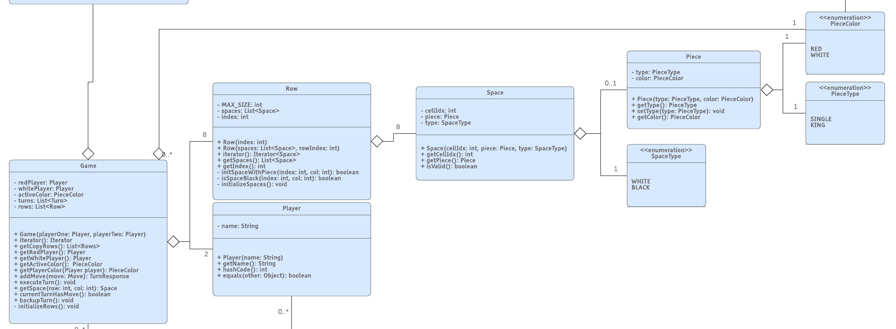
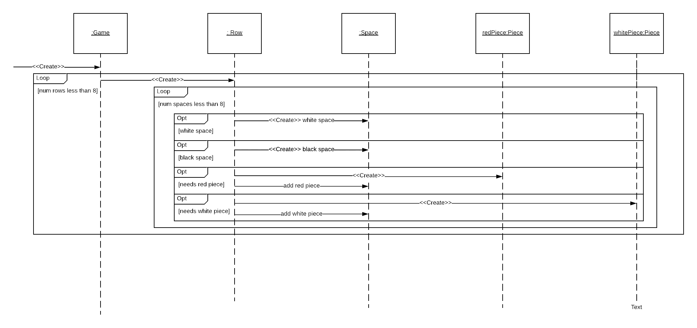

# PROJECT Design Documentation

## Team Information
* Team name: Avoiding Zugzwang
* Team members
  * Andrew Bado
  * Collin Bolles
  * Jacob Jirinec
  * Tristan Knox
  * Evan Nolan

## Executive Summary

How does one recreate a game that is as old and as simple as Checkers in a way that is both exciting and desirable to play? 
The answer, **WebCheckers**! 
This new rendition of Checkers will leave players wanting more. 
By connecting players worldwide WebCheckers brings endless opportunity to test your checker's prowess against any number of opponents. 
And with the ability to practice against AI players and watch replays anyone will be able to take their game to the next level. 
So what are you waiting for, grab your mouse, your keyboard, and your fanciest checkers hat and **lets play WebCheckers!**

### Purpose
WebCheckers aims to provide users means to play games of checkers with others from around the world.
Users should be able to view other users who are looking to play a game and allow them to request a game with anyone from that list.

### Glossary and Acronyms

| Term | Definition |
|------|------------|
| MVP  | Minimum Viable Product    |
| OOP  | Object Oriented Programming|
| POJOS| Plain Old Java Objects|
| UI   | User Interface|
| HTML | Hyper Text Markup Language|
| CSS  | Cascading Style Sheets|
| HTTP | Hyper Text Transfer Protocol|

## Requirements

This section describes the features of the application.

### Definition of MVP
The minimum viable product allows user to log into the web app and play games of checkers with other users. 
This web app enforces standard checkers rules. Users are able to resign from games if they do not wish to finish a game. 
### MVP Features
SignIn  
SignOut  
Start Game  
Resign Game  
Make Moves  
Make Jump Moves  
Make Miltie Jump Moves  
Capture Pieces  
King Piece  

### Roadmap of Enhancements
Watch Replay 
AI Player

## Application Domain

This section describes the application domain.

The main entity in the Domain Model is the ‘Checkers Game’ entity. This entity at a high level 
handles the interactions that exists with the other domain entities. The ‘Checkers Game’ is played
on a ‘Board’ which is made up of ‘Tiles’ which are the individual spaces on the board. The
relation between the ‘Board’ and ‘Tiles’ are important since the ‘Tiles’ represent different
functionality on the ‘Board’. For example, the light vs. dark tiles impact if a ‘Piece’ can be
placed in the given ‘Tile’. Another important entity is the ‘Player’ entity. The ‘Player’
represents the two opposing sides in checkers. ‘Player’ interacts with the ‘Pieces’ and the
color of each ‘Piece’ represents each of the ‘Players’. ‘Turns’ is another important domain
entity as it handles interactions between the ‘Players’ and the ‘Tiles’ through the ‘Move Rules’. 

## Architecture and Design

This section describes the application architecture.

### Summary

The following Tiers/Layers model shows a high-level view of the webapp's architecture.

As a web application, the user interacts with the system using a
browser.  The client-side of the UI is composed of HTML pages with
some minimal CSS for styling the page.  There is also some JavaScript
that has been provided to the team by the architect.

The server-side tiers include the UI Tier that is composed of UI Controllers and Views.
Controllers are built using the Spark framework and View are built using the FreeMarker framework.  The Application and Model tiers are built using plain-old Java objects (POJOs).

Details of the components within these tiers are supplied below.

### Overview of User Interface

This section describes the web interface flow; this is how the user views and interacts
with the WebCheckers application.

As soon as the user enters the page they will be greeted by a message that displays how many people
 are currently in the player lobby waiting for a game. If they are not signed in they will be asked 
 to sign in using a name of their choosing. Leading to the “waiting for username” and brought to a 
 sign in page. There they can put in a name, which is checked to be a good username. That username 
 is checked for clearance and if it is a good one they move on, else they will be asked to choose a 
 username and given the rules for which to do so. Once they move on they will be brought to the 
 player lobby. Where all the names of potential opponents await to merely be clicked on to be
  brought a game! If such a challenge of clicking on the opponent is issued via a click
  on their name, then they will be given the option to accept or decline the challenge. 
  If it is accepted they will be brought to a new page that displays their board positions 
  and be brought to the “In game” state. Where a plethora of options await the user. One such 
  option is to resign where they will be taken back to the home page. Another is to play the game 
  by making a move which is validated and then brought to the opponents turn once submit turn is
  done. If such a move resulted in the ending of a game they are then brought to the “endgame” 
  where the homepage of the player lobby will be the next sight for the user to see. And lastly
  at any moment where they are in the home page and they wish to sign out they will be taken
  back to the sign in page where they can exit or resign in. 

### UI Tier

The UI tier is responsible for all of the communications between the user and the server. 
Any time the user is submitting information a post route is used to send data to the server. 
Any time the user’s view needs to be updated a get route is used to render the new view. 
The classes in the UI tier are responsible for user stories such as signing in, starting a game, 
resigning a game and more.

#### Starting a Game
Once a user has signed in the GetHomeRoute is responsible for providing a list of all players that are available for a game. 
The user then has the ability to select another player from that list. 
When an opponent is selected the PostRequestGameRoute is activated and the name of the opponent is posted to the server.

First, the Player that made the request is accessed from the session. 
Next, the posted username of the opponent is accessed via the request. 
The Opponents name is used to get the Player object associated with that name from the player lobby. 
The availability of both players is then checked. If either of the players is found to be unavailable the player who 
initiated the request is redirected back to the home page where a message informs them that the other player had already 
joined a game. Otherwise, if both the players are available the players are passed to the game center to spawn a new game. 
The game center injects both of the players that it received into the new game that it created and stores that game in a 
list of games being played. The game is then returned back to the PostGameRequestRout where it is then passed into the 
ViewGenerator along with the current player, which arranges the board into the correct orientation for the given player. 
Finally, the game view is rendered for the player.

Meanwhile, the other player is sent to the GetGameRoute. 
Inside the GetGameRout the current player is accessed from the session and all of the relevant information needed for 
the game view is put into the viewModel map. The info included in this is the current player, the red player, the white 
player, and the active color. Finally, the game associated with the player is accessed through the game center and passed 
into the ViewGenerator to arrange the board for the given player. The game board is then also added to the viewModel before 
rendering the game view for the player.

#### Making Moves
When it is users turn the user is notified via the turn marker in the infobox. 
The player is then able to drag and drop pieces on the board. 
When a piece is dropped onto a new location the PostMoveRequestRout is activated.

First, JSON string is retrieved from the request. 
The JSON string is then decoded and turned into a Move object using Gson. 
Next, the game can be accessed by getting the player from the session and passing the player to the game center. 
Once the game has been retrieved the move can be verified. 
The move is passed to the game, if the move is valid it is added to a turned object which keeps track of all moves made 
for a given turn and an info message is generated to inform the user the move is valid. 
Otherwise, an error message is generated containing info on why the move is not valid. Either way, the message generated 
is converted to JSON and then returned to the user and the Java Script updates the users view acordingly.

#### SignOut

A user is able to sign out from anywhere once they are signed in. 
If a user is signed in there is a button toward the top used for signing out. 
If the user clicks on the sign out button the PostSignOutRoute is activated.

First, the player is retrieved from the session and is used to verify if the user is currently in a game via the game center. 
If the player is in a game the PostResignRoute is activated to ensure that the players opponent is notified. 
Either way, the player is then removed from the player lobby and then the player is removed from the sessions attributes. 
Finally, the user is redirected to the home page where they will then see the option to sign in.

#### Resignation

A user is able to resign from a game before the game is over. When a user is in a game there is a resign button. If the resign button is pushed the PostResignationRoute is activated. The first thing that happens is that the current player is accessed through the session. That player is placed back into the player lobby before the player is passed to the game center’s resignation method. 
The resignation method flags the game associated with the given player as over and the player is removed from the game. Finally, back in PostResignationRoute, an info message is returnd informing the client side that someone has resigned.

### Application Tier
> _Provide a summary of the Application tier of your architecture. This
> section will follow the same instructions that are given for the UI
> Tier above._

### Model Tier
The model tier is made up of three main classes. The Game, Player, and 
Turn each represent major functionality of the application. The Game 
handles representation of the checkers board over all including the 
rows, pieces, and spaces on the board. The Player represents a user of
the game who is currently using the application. The Turn represents 
the process of a user going through and making a move in the checkers
application. All interactions with the model tier during game play is 
handled through the Game which then distributes the responsibility to 
the other model tier classes.

#### Game

The Game model handles all of the representation of the checkers board.
The logic of creation of the board’s initial state including the rows 
and spaces is handled within the game. The game also keeps track of all
turns made on it by users. This list is will be used later as part of the
Replay enhancement but is currently used to keep track of the current turn.
Interactions with the model tier takes place through the Game model
including the addition of Moves to a Turn. 

When a game is created, the board
is setup to its initial position and is then interacted through moves to
modify the game.

#### Player

The Player is a simple class which represents a single user via the 
username. The main use of Player is through the passing of the Player 
between the front-end and the back-end. Here the player represents how 
a given user is associated with a given Game. The Player does not handle 
any functionality directly. See PlayerLobby in the application tier to 
see more uses of the Player.

#### Turn

The Turn represents the series of moves that are made during a Player’s
turn in the game of checkers. The Turn therefore keeps track of the various 
positions that pieces are being moved to. 

In addition to the Turn keeping track of the moves made using the turn,
the Turn class also validates each move being added. Each move is validated
against the rules of checkers by executing the series of methods shows in
the UML diagram. If any of the method calls fail, the corresponding
TurnResponse is returned and the move is not added to the list of moves.

After the moves have been added, Turn handles the execution of the move.
This involves taking in a game on which each move is executed onto. Note
no validation takes place here. Pieces are captured and others flipped to
king pieces as needed.

### Design Improvements
> _Discuss design improvements that you would make if the project were
> to continue. These improvement should be based on your direct
> analysis of where there are problems in the code base which could be
> addressed with design changes, and describe those suggested design
> improvements. After completion of the Code metrics exercise, you
> will also discuss the resutling metric measurements.  Indicate the
> hot spots the metrics identified in your code base, and your
> suggested design improvements to address those hot spots._

## Testing
> _This section will provide information about the testing performed
> and the results of the testing._

### Acceptance Testing
> _Report on the number of user stories that have passed all their
> acceptance criteria tests, the number that have some acceptance
> criteria tests failing, and the number of user stories that
> have not had any testing yet. Highlight the issues found during
> acceptance testing and if there are any concerns._

### Unit Testing and Code Coverage
> _Discuss your unit testing strategy. Report on the code coverage
> achieved from unit testing of the code base. Discuss the team's
> coverage targets, why you selected those values, and how well your
> code coverage met your targets. If there are any anomalies, discuss
> those._
